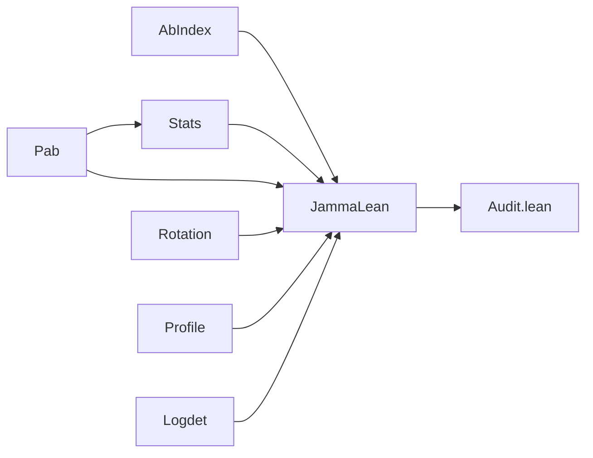

# jamma-lean

Machine-checked proofs, in Lean 4 with Mathlib, of the exact-arithmetic
identities that [JAMMA](https://github.com/michael-denyer/jamma)'s linear mixed
model implements. Every theorem is stated over ℝ. Floating-point rounding is out
of scope: these proofs show the formulas are right, not that their `float64`
evaluation stays within JAMMA's tolerances.

## Quick start

```bash
lake exe cache get
lake build
lake env lean Audit.lean
```

`Audit.lean` prints the axioms behind each headline theorem. Every line must
list only `propext`, `Classical.choice` and `Quot.sound`; `sorryAx` would mean
an unfinished proof.

## What is proved

| Code (JAMMA `src/jamma/`) | Lean theorem | Statement |
|---|---|---|
| `lmm/pab.py` `get_ab_index`, `core/constants.py` `n_index` | `AbIndex.abIndex_image`, `abIndex_comm`, `n_index_eq` | The packing maps the `cols(cols+1)/2` unordered pairs bijectively onto `0 … n_index-1`, and is symmetric |
| `lmm/pab.py` `calc_pab`, rows `1 … n_cvt+1` | `Pab.pab_succ` | `Pab[p] = Pab[p-1] - Pab[p-1,aw]·Pab[p-1,bw] / Pab[p-1,ww]`, including the `ps_ww == 0` branch (Lean's `x / 0 = 0`) |
| `calc_pab` meaning | `Pab.resid_spec`, `resid_unique`, `pab_eq_inner_resid_left` | Level `p` is the inner product after orthogonal projection off `span{w₁ … w_p}`; the result depends only on that span |
| `guard_p_yy` | `Pab.pab_self_nonneg` | Every exact `P_aa ≥ 0`, so a negative `P_yy` is numerical breakdown |
| `compute_Uab` and row 0 of `calc_pab` | `Rotation.pab_row0_eq_dense`, `quad_form_rotated`, `hMat_inv` | `Σ Hi_eval · (Uᵀa)(Uᵀb) = aᵀ(λK + I)⁻¹b` for `K = U diag(ev) Uᵀ`, `U` orthogonal |
| `likelihood_numpy.py` `logdet_h` | `Rotation.logdet_hMat`, `det_hMat` | `Σ log(λ·ev + 1) = log det(λK + I)` |
| `lmm/_lmm_logdet.h` `logdet_h_lambda` | `Logdet.logdetKernel_eq_sum_log` | The four-lane mantissa product with renormalisation and a single `log` equals `Σ log vᵢ`, for any split `v = m·2^e` with `m > 0` |
| `likelihood_numpy.py` `_logl_const` with `- ½ m log P_yy` | `Profile.gaussLogL_le_profiled`, `gaussLogL_at_argmax`, `gaussLogL_argmax_unique` | The profiled form is the Gaussian log-likelihood maximised over σ², reached only at `σ² = P_yy / m` |
| `stats.py` `Px_YY` | `Stats.px_yy_eq` | `Px_YY = P_YY - P_XY² / P_XX` |
| `stats.py` Wald | `Stats.waldF_eq_beta_sq_div_var`, `waldF_eq_r2`, `waldF_nonneg` | `F = β² / Var(β) = df·r² / (1 - r²) ≥ 0` |
| `stats.py` Score | `Stats.scoreF_eq_r2`, `scoreF_le_n` | `F = n·r² ≤ n` |
| `stats.py` `_f_to_pvalue` | `Stats.complement_z` | `f / (df + f) = 1 - df / (df + f)` exactly |

`r² = P_XY² / (P_XX·P_YY)` is the projected squared correlation of genotype and
phenotype.

## Not proved yet

* `logdet_hiw`, the REML `Σ log Pab[i, ii] - Σ log Iab[i, ii]` term, as
  `log det(WᵀH⁻¹W) - log det(WᵀW)`. This is the Gram determinant as a product of
  Gram–Schmidt squared norms.
* The closed form `P = H⁻¹ - H⁻¹W(WᵀH⁻¹W)⁻¹WᵀH⁻¹`. `resid_unique` already pins
  `Pab` to the `H⁻¹`-orthogonal projection, which is the same operator.
* REML invariance to centring the kinship matrix.
* The F and χ² distribution functions (`betainc`, `chi2_sf`). Mathlib has no
  regularised incomplete beta.
* Any floating-point error bound (`docs/GEMMA_NUMERICAL_EQUIVALENCE_BOUND.md`).

## Layout



Each file in `JammaLean/` opens with a module docstring naming the JAMMA
function it models.
